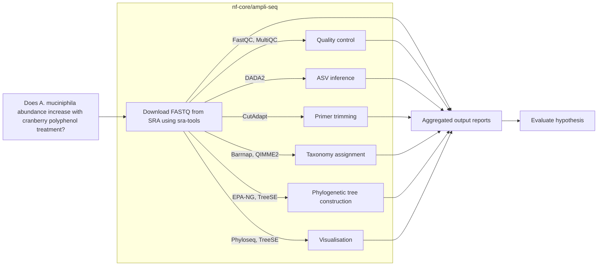

# BCHM5420_class_project
## Cranberry Polyphenols and *Akkermansia mucniphila*: nf-core/ampliseq 16S rRNA Profiling



### Introduction
*Akkermansia muciniphila* is a polyphenol-resistant, mucin-degrading gut bacterium strongly associated with improved intestinal health. Dietary polyphenols have been shown to stimulate intestinal mucus production, enhancing the ecological niche for *A. muciniphila*. Because *A. muciniphila* is resistant to polyphenols and faces reduced competition from other susceptible microbes, its abundance tends to increase following polyphenol supplementation. 

### Research Hypothesis
Cranberry-derived polyphenol supplementation increases the abundance of Akkermansia muciniphila in the human gut.

### Pipeline Overview
This project leverages the nf-core/ampliseq pipeline to perform 16S rRNA community profiling on gut microbiome samples. The pipeline includes the following tools:
- **FastQC** for quality control of raw reads
- **Cutadapt** for quality trimming of raw reads
- **DADA2** for denoising and ASV inference
- **Barrnap** to predict whether ASVs are rRNA sequences
- **EPA-NG** for phylogenetic placement
- **QIIME2** for microbial community analysis
- **Phyloseq** (R package) for statistical analysis and visualization
- **TreeSE** for tree-based micrbial community comparisons
- **MultiQC** for summary reporting

### Data Sources
- Raw FASTQ files are downloaded from the [Sequence Read Archive (SRA)](https://www.ncbi.nlm.nih.gov/sra/) under BioProject **PRJNA955174** using sra-tools (prefetch and fasterq-dump). 
- Metadata is downloaded from the [SRA](https://www.ncbi.nlm.nih.gov/sra/) website using the RunSelector function.

## Quick Start
On local machine:
```bash
./run_pipeline.sh
```
On HPC:
```bash
sbatch run_pipeline.sh
```
## Parameters
Parameters must be set in the `./nextflow.config` and `./run_pipeline.sh` files.
| **Parameter**                 | **Default Value**                                         | **Description**                                                                                                     |
| ----------------------------- | --------------------------------------------------------- | ------------------------------------------------------------------------------------------------------------------- |
| `-profile`                    | `docker`                                   | Nextflow configuration profile to use (e.g., `docker`, `singluarity`). | 
| `--input_folder`              | `./results/fastq/`                                        | Path to the directory containing raw FASTQ files.                                                                          |
| `--extension`                 | `*_{1,2}.fastq.gz`                                        | File extension pattern for forward and reverse reads (e.g., `_1.fastq.gz` and `_2.fastq.gz`).                       |
| `--FW_primer`                 | `TCGTCGGCAGCGTCAGATGTGTATAAGAGACAGCCTACGGGNGGCWGCAG`      | Forward primer sequence.                                 |
| `--RV_primer`                 | `GTCTCGTGGGCTCGGAGATGTGTATAAGAGACAGGACTACHVGGGTATCTAATCC` | Reverse primer sequence.                                 |
| `--metadata`                  | `./data/metadata.tsv`                                    | Path to the metadata file in TSV format.                                                                            |
| `--metadata_category`         | `VISIT,SUBJECT`                                           | Comma-separated list of metadata columns to analyze samples.                                     |
| `--metadata_category_barplot` | `VISIT`                                                   | Metadata column used specifically for colouring samples in bar plots.                                       |
| `--trunc_qmin`                | `25`                                                      | Minimum quality threshold for truncation of reads.           |
| `--outdir`                    | `.results/ampliseq`                                       | Output directory for storing all results generated by the pipeline.                                                 |
| `--ancombc`                   | *NA*                         | Enables differential abundance analysis using the `ANCOM-BC` method.                                                |

## Installation
1. Clone the repository:
```bash
git clone https://github.com/gtiegs/BCHM5420_class_project.git
cd BCHM5420_class_project
```
2. Create a conda environment with `environment.yml`:
```bash
conda env create -f environment.yml
```
3. Activate the environment:
```bash
conda activate BCHM5420_class_project
```
4. Run the pipeline:
```bash
chmod +x run_pipeline.sh
./run_pipeline.sh
```

## Outputs
Directory structure:
```
.
|
results/
├── multiqc/
│   └── multiqc_report.html
├── phyloseq/
│   └── dada2_phyloseq.rds
├── qiime2/
│   ├── rel_abundance_tables/
│   ├── barplot/
│   ├── barplot_average/
│   └── ancombc/
│       └── da_barplot/
├── summary_report/
│   └── summary_report.html
```

The ampliseq pipeline generates the following outputs:
- `./results/summary_report/summary_report.html`: A summary report of major prcoesses.
- `./results/multiqc/multiqc_report.html`: A summary report generated by MultiQC.
- `./results/phyloseq/dada2_phyloseq.rds`: A phyloseq object containing the ASV table and metadata.
- `./results/qiime2/rel_abundance_tables/`: A directory containing relative abundance tables for different taxonomic levels. 
- `./results/qiime2/barplot/`: A directory containing relative frequency barplots for different taxonomic levels.
- `./results/qiime2/barplot_average/`: A directory containing average relative frequency barplots for different taxonomic levels.
- `./results/qiime2/ancombc/da_barplot/`: A directory containing LFC barplots for different taxonomic levels.

## References
Lessard-Lord, J. et al. Short term supplementation with cranberry extract modulates gut microbiota in human and displays a bifidogenic effect. NPJ Biofilms Microbiomes 10, 18 (2024).
Straub, D. et al. Interpretations of Environmental Microbial Community Studies Are Biased by the Selected 16S rRNA (Gene) Amplicon Sequencing Pipeline. Front. Microbiol. 11, (2020).