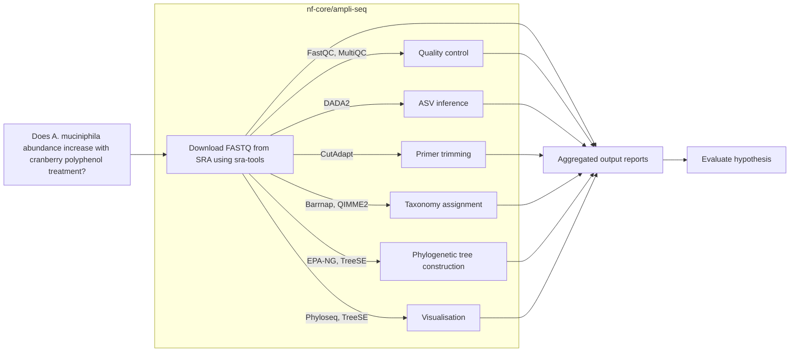

# BCHM5420_class_project
## Cranberry Polyphenols and *Akkermansia mucniphila*: nf-core/ampliseq 16S rRNA Profiling

### Introduction
*Akkermansia muciniphila* is a polyphenol-resistant, mucin-degrading gut bacterium strongly associated with improved intestinal health. Dietary polyphenols have been shown to stimulate intestinal mucus production, enhancing the ecological niche for *A. muciniphila*. Because *A. muciniphila* is resistant to polyphenols and faces reduced competition from other susceptible microbes, its abundance tends to increase following polyphenol supplementation. 

### Research Hypothesis
Cranberry-derived polyphenol supplementation increases the abundance of Akkermansia muciniphila in the human gut.

### Pipeline Overview
This project leverages the nf-core/ampliseq pipeline to perform 16S rRNA community profiling on gut microbiome samples. The pipeline includes the following tools:
- **FastQC** for quality control of raw reads
- **Cutadapt** for quality trimming of raw reads
- **DADA2** for denoising and ASV inference
- **Barrnap** to predict whether ASVs are rRNA sequences
- **EPA-NG** for phylogenetic placement
- **QIIME2** for microbial community analysis
- **Phyloseq** (R package) for statistical analysis and visualization
- **TreeSE** for tree-based micrbial community comparisons
- **MultiQC** for summary reporting

### Data Sources
- Raw FASTQ files are downloaded from the [Sequence Read Archive (SRA)](https://www.ncbi.nlm.nih.gov/sra/) under BioProject **PRJNA955174** using sra-tools (prefetch and fasterq-dump). 
- Metadata is downloaded from the [SRA](https://www.ncbi.nlm.nih.gov/sra/) website using the RunSelector function.